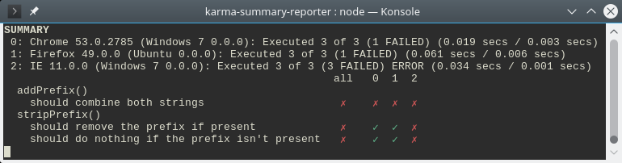
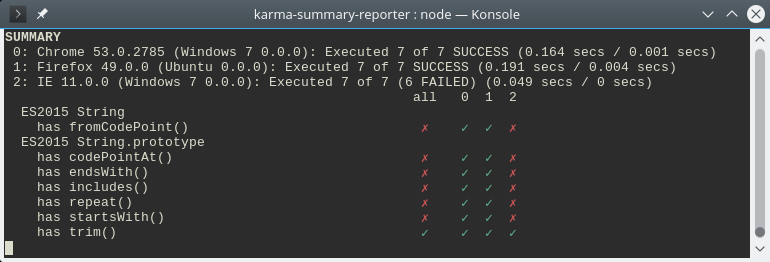

# karma-summary-reporter

Show a table detailing the test results for all connected browsers at the end
of a test run. This gives a better overview which browsers are broken than the
output of other reporters.

The plugin is intended to be used in addition to some other reporter that
shows you the error details. This plugin only shows an overview of passed and
failed testcases, no more detailed information:




## Use cases

### Testing in several browsers

When you test in several browsers, the sequential test output of all the
browsers can be unwieldy to quickly grasp the problems in the tests. The
summary table provided by this reporter shows the failing tests in a
compact format that is easy to grasp at a glance:


Here we can clearly see that `addPrefix()` has some general problem while
the error in `stripPrefix()` seems to be specific to IE.


### Feature tests

The summary table is also useful if you want to (ab-)use karma to run 
feature tests, like checking which standard string functions are available:



We can see that IE is lacking some features here.

## Installation

With npm:

    npm install --save-dev karma-summary-reporter

With yarn:

    yarn add --dev karma-summary-reporter

## Config

```javascript
module.exports = function(config) {
   config.set({
      reporters: ['progress', 'summary'],
      summaryReporter: {
         // 'failed', 'skipped' or 'all'
         show: 'failed',
         // Limit the spec label to this length
         specLength: 50,
         // Show an 'all' column as a summary
         overviewColumn: true
      }
   });
};
```

### show

Select which tests are displayed in the summary. There are three choices:

- `'failed'`: Only show tests that failed in some browser (default)
- `'skipped'`: Additionally show tests that got skipped in some browser
- `'all'`: Show all test, also ones that didn't fail

### specLength

Space reserved to display the spec label (width of the first column in
the results table).

### overviewColumn

Shows a overview column in the results table, showing the total result of
a test over all browsers ("failed" if the test failed anywhere, ...). In
the above examples this is the column with the "all" header. Setting this
option to `false` disables this column.

## Test failure details

This reporter just shows a summary of failed test cases once testing is
complete, it doesn't show stack traces or other useful information about
the failures.

To display these details, add an additional reporter to your `karma.conf.js`
that shows all the additional information you want to see. For example, to
run the summary reporter in addition to the `spec` reporter you'd have this
configuration:

```javascript
reporters: ['spec', 'summary']
```

Or with [`karma-mocha-reporter`][1] your config could look like this:

```javascript
reporters: ['mocha', 'summary']
mochaReporter: { output: 'minimal' }
```

[1]: https://github.com/litixsoft/karma-mocha-reporter


